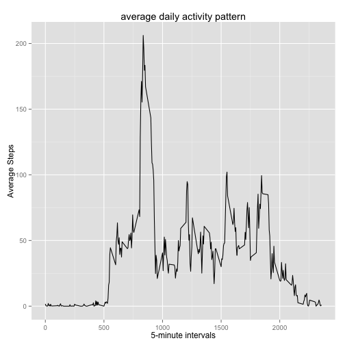
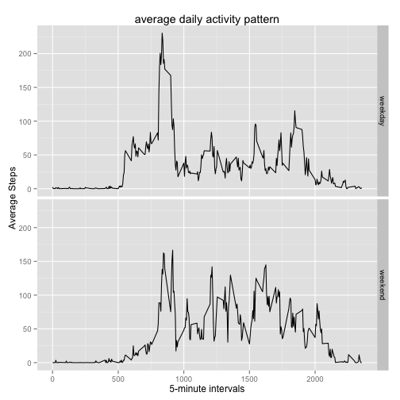

## Loading and preprocessing the data

```r
activities <- read.csv("activity.csv",header = TRUE, sep = ",", colClasses=c(NA,"Date",NA))
activitiesByDate <- group_by(filter(activities,!is.na(steps)), date)
```

## What is mean total number of steps taken per day?

```r
stepsByDay <- summarise(activitiesByDate,TotalStepsByDay=sum(steps,na.rm = TRUE))
```

Histogram of the number of Steps taken each day:

```r
hist(stepsByDay$TotalStepsByDay, main="Freq. of the total number of steps taken each day", xlab = "total steps")
```

 

mean and median total number of steps taken per day:

```r
summarise(stepsByDay,meanSteps=mean(TotalStepsByDay),medianSteps=median(TotalStepsByDay))
```

```
## Source: local data frame [1 x 2]
## 
##   meanSteps medianSteps
## 1  10766.19       10765
```

## What is the average daily activity pattern?

```r
activitiesByIntervals <- group_by(filter(activities,!is.na(steps)), interval)
meanStepsByInterval <- summarise(activitiesByIntervals, meanSteps=mean(steps))
qplot(interval, meanSteps, data=meanStepsByInterval,geom="line",main="average daily activity pattern",xlab="5-minute intervals", ylab="Average Steps")
```

 


```r
maxNumberOfStepsInterval <- meanStepsByInterval[which.max(meanStepsByInterval$meanSteps),"interval"]
```

5-minute interval with the max number of steps: **835**

## Imputing missing values

- Calculate and report the total number of missing values in the dataset (i.e. the total number of rows with NAs)

```r
numMissingValues <- length(activities[is.na(activities$steps),"steps"])
```

Number of missing values in the dataset: **2304**

- Devise a strategy for filling in all of the missing values in the dataset. 

The strategy I adopt is to fill missing values with the mean for that 5-minute interval.

- Create a new dataset that is equal to the original dataset but with the missing data filled in

```r
# joining the meanStepsByInterval dataset and the activities dataset
joined <- inner_join(activities, meanStepsByInterval, by="interval")

# replacing missing values
activities[is.na(activities$steps),]$steps <- joined[is.na(joined$steps),"meanSteps"]
```

- Make a histogram of the total number of steps taken each day and Calculate and report the mean and median total number of steps taken per day. Do these values differ from the estimates from the first part of the assignment? What is the impact of imputing missing data on the estimates of the total daily number of steps?


```r
# recomputing activitiesByDate dataframe
activitiesByDateFilled <- group_by(activities, date)
stepsByDayFilled <- summarise(activitiesByDateFilled,TotalStepsByDay=sum(steps))
hist(stepsByDayFilled$TotalStepsByDay, main="Freq. of the total number of steps taken each day", xlab = "total steps")
```

 

mean and median total number of steps taken per day:

```r
summarise(stepsByDayFilled,meanSteps=mean(TotalStepsByDay),medianSteps=median(TotalStepsByDay))
```

```
## Source: local data frame [1 x 2]
## 
##   meanSteps medianSteps
## 1  10766.19    10766.19
```

**Q: Do these values differ from the estimates from the first part of the assignment?**

A: Mean does not seem to be affected by filling NAs with the mean of the 5-minute interval.

Median changes a bit, since we're adding more values.

**Q: What is the impact of imputing missing data on the estimates of the total daily number of steps?**

Imputing 5-minutes means into missing data doesn't seem to affect the daily number of steps.

## Are there differences in activity patterns between weekdays and weekends?

- Create a new factor variable in the dataset with two levels...


```r
days <- ifelse(weekdays(activities$date) %in% c("Saturday","Sunday"),"weekend","weekday") 

activities$typeOfDay <- as.factor(days)
```

- Make a panel plot containing a time series plot ...


```r
activitiesByWeekdayAndIntervals <- group_by(activities, typeOfDay, interval)

meanStepsByWeekDayInterval <- summarise(activitiesByWeekdayAndIntervals, meanSteps=mean(steps))

qplot(interval,meanSteps,data=meanStepsByWeekDayInterval,main="average daily activity pattern",xlab="5-minute intervals", ylab="Average Steps",facets=typeOfDay ~ .,geom="line")
```

 
